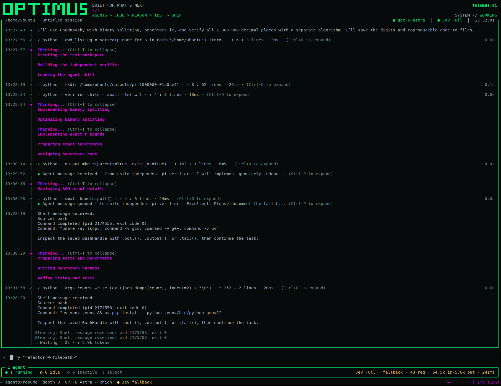
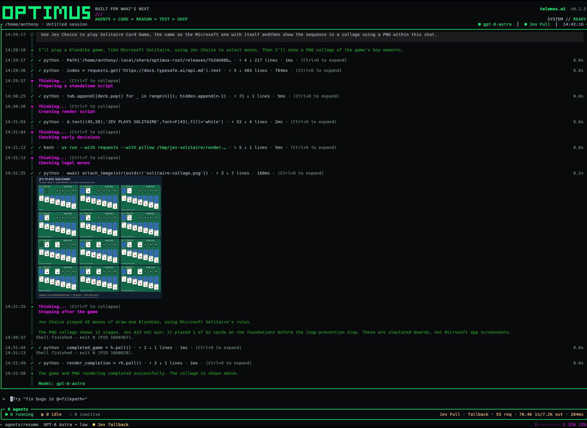

# Optimus Agent

**A self-improving, multi-model harness for coding, research, and long-running work, implemented in Rust with a persistent Python runtime.**

Maintained by [Telemus AI](https://github.com/telemusai).

[Install](#install-and-update) · [Get started](#get-started) · [Memory and learning](#memory-that-you-can-inspect-and-correct) · [Jev](#jev-integration) · [Implementation](#implementation) · [Documentation](#documentation)

Optimus is the layer between an AI model and real work: the tools it can use, the context it retains, the agents it coordinates, and the state it recovers when a session ends or a connection drops.

It combines a persistent Python workspace, recursive subagents, inspectable memory, provider-aware context management, and background execution. Use one model to plan and review, others to investigate or build, and keep the work connected across sessions.

Optimus supports **native Windows reliability, stronger session continuity, Astra-aware model handling, project-scoped learning, measurable efficiency, and a Rust implementation of the application layer.** See [Foundations and acknowledgements](#foundations-and-acknowledgements) for the projects it builds on.





*Optimus Agent playing Solitaire using full JEV integration.*

## Install and update

The standalone installers select the **highest stable `vMAJOR.MINOR.PATCH` tag** from this repository and build it locally with Cargo's locked dependencies. They exclude prerelease tags and never install an untagged `main` build. Run the same command again to update; an already-installed tag is left in place. Standalone installation starts with the **latest release**.

Install the prerequisites first: [Rust/Cargo](https://rustup.rs/), [Python 3.11+](https://www.python.org/downloads/), [uv](https://docs.astral.sh/uv/getting-started/installation/), Git, and native C/C++ build tools. Linux also needs `curl`, Bash, `pkg-config`, and OpenSSL development headers (Ubuntu/Debian: `build-essential pkg-config libssl-dev`). macOS needs Xcode Command Line Tools. Windows needs [Git for Windows with Git Bash](https://gitforwindows.org/) and [Visual Studio Build Tools](https://visualstudio.microsoft.com/visual-cpp-build-tools/) with **Desktop development with C++**, a Windows SDK, and the MSVC Rust toolchain. Reopen the terminal after installing prerequisites.

**macOS / Linux — install or update**

```bash
curl -fsSL https://telemus.ai/optimus-agent/install.sh | sh
```

**Windows PowerShell — install or update**

```powershell
powershell -ExecutionPolicy ByPass -c "irm https://telemus.ai/optimus-agent/install.ps1 | iex"
```

Compilation can take several minutes and needs several GB of temporary disk space. The installer removes its source/build directory afterward and retains previous installed releases, settings, credentials, and sessions. Existing daemons are not restarted automatically.

On macOS/Linux, add `~/.local/bin` to your shell's PATH if needed (`export PATH="$HOME/.local/bin:$PATH"`). Windows adds that directory to your user PATH; open a new terminal. Then run `optimus-agent` from your project directory, or `optimus-agent --continue` to reopen its last saved conversation.

See the [installer source](installers/) and [launcher guide](docs/RUST_LAUNCHER.md) for details, custom installation directories, and source builds.

## Project status

| Area | Current position |
| --- | --- |
| Main implementation | Rust application with a persistent Python execution runtime; no TypeScript application or npm workspace |
| Rust implementation | Available on `main`, installed as `optimus-agent`; remaining parity gaps are documented |
| Platforms | macOS, Linux, and native Windows; Windows currently requires a Bash shell such as Git Bash |
| Memory | Session, project, and global harness memory, with optional selected sharing; authoritative project storage is JSON |
| Jev integration | Optional TypeSafe System One decisions, code-search filtering/reranking, semantic line finding, request-local compaction, and Dynamic questions through `jev_decide`; full-Jev enables all native feature gates |
| TencentDB-backed memory | An intended integration direction, not an implemented backend in the current `main` branch |

The feature descriptions below refer to `main` unless explicitly marked as development work. Some hardened Windows installations also use deployment-specific launchers and compatibility layers that are not included in a plain source checkout.

## What makes Optimus different

### A programmable workspace, not just a chat loop

The persistent Python REPL gives the agent a working environment that survives individual tool calls. It can inspect a repository, transform data, retain intermediate results, execute commands, and invoke skills through code.

Recursive language model (RLM) workflows let the agent delegate work into separate contexts rather than put every investigation into one growing conversation. Parent and child agents can exchange attributed messages and return results for review.

- Delegate independent investigations or implementation tasks in parallel.
- Use different configured models for different roles.
- Keep Python state and session history available for subsequent work.
- Extend the harness with Python skills, prompt templates, extensions, and MCP tools.

**Self-improving means improving the harness around the model—not training new model weights.** Refinement can preserve useful instructions, memories, skill descriptions, and subagent specifications for later work.

### Context management that understands the provider

Large context windows are useful, but they are not a reason to let every conversation grow indefinitely.

Optimus retains an inclusive **250,000-token automatic-compaction ceiling**. Models with smaller usable windows compact earlier to preserve their response reserve. The ceiling does **not** shrink the model's advertised context window or change its reasoning level.

The fork includes provider-native compaction and checkpoint replay for supported OpenAI/Codex routes, including Astra handling. Other routes use the supported summarization path unless a native-compaction endpoint has been explicitly verified. A shared model name does not imply that Azure, GitHub, Bedrock, or another gateway implements the same protocol.

Compaction work includes saved-checkpoint restoration, continuation of incomplete subagent work, and preservation of queued input. WebSocket handling retains connection reuse and incremental requests where supported, with bounded recovery that avoids transparently replaying a partially delivered response.

Fast/service-tier selection remains separate from reasoning effort and context management, and depends on the provider. It is not a prerequisite for using Astra.

### Memory that you can inspect and correct

Optimus provides a continual harness with project-scoped memory and explicit controls for recall, learning, provenance, and recovery.

- **Separate scopes:** retain session-specific facts, reusable project knowledge, and global harness entries.
- **Selective recall:** bring relevant entries into context within bounded recall limits.
- **Evidence references:** associate learned entries with the material used to produce them.
- **Corrections and history:** inspect revisions, supersede outdated facts, and roll back unchanged edits.
- **Selected history import:** review and recover knowledge from chosen saved sessions instead of indiscriminately importing every conversation.
- **Optional sharing:** explicitly share selected project memories through a configured service. Host-specific facts and full transcripts are not automatically shared.

Recall and learning are independent controls. You can stop new automatic learning while continuing to use existing memory, or turn off recall without deleting the underlying knowledge.

```text
/memory status
/memory search deployment decisions
/memory history
/memory recall off
/memory learning off
```

Current project memory is stored in versioned JSON state. Ordinary recall does not require a separate vector database or an extra model request. **TencentDB integration is a future direction; it is not a requirement for the memory system that ships today.**

See [Project memory](https://github.com/telemusai/optimus-agent/blob/main/resources/agent/docs/project-memory.md) for source validation, imports, backups, sharing, and the Python memory API.

### Native Windows as a real operating environment

Optimus carries Windows-focused work across process management, Python execution, persistence, and session recovery. The current Windows path runs on native Windows with Git Bash; WSL is not required for that path.

The work includes safer worker recovery, Windows path handling, bounded persistence retries, Python skill packaging, and kernel interruption and cleanup behavior. Session browsing distinguishes main conversations from inactive subagents, while retaining access to child histories through their parents.

The terminal is a client of the running agent services. A terminal disconnect and a worker failure are different events, and the harness tracks them separately. Persistent deployments must also launch those services independently of disposable editor or terminal-host processes.

See [Windows setup](https://github.com/telemusai/optimus-agent/blob/main/resources/agent/docs/windows.md). Machine-specific gateways, credentials, scheduled tasks, and guarded installation packages are deployment configuration—not bundled public defaults.

### Long-running work with explicit controls

Goals, autonomous continuation, heartbeats, and schedules support work that spans multiple turns or sessions. Background agents can be detached and revisited, with saved history and execution state available for recovery.

Use explicit budgets and stop controls. An idle worker is not proof of a completed task, and a successful tool call is not proof that the overall objective is finished. The fork adds bounded incomplete-child recovery and runtime-owned result delivery so parent agents are less dependent on a child remembering to send its final report.

### Multiple models, one harness

Optimus supports provider authentication, custom model definitions, and model-specific reasoning and tool behavior. Integrations include OpenAI/Codex, GitHub Copilot, Azure OpenAI/Foundry-compatible routes, Amazon Bedrock, and OpenAI-compatible services such as Ollama endpoints.

Use the model appropriate to each task: a planner or reviewer, an implementation agent, or a focused researcher. Authentication method, subscription entitlement, available models, image support, service tiers, and compaction capability vary by provider. Custom gateways require their own configuration.

See [Providers](https://github.com/telemusai/optimus-agent/blob/main/resources/agent/docs/providers.md) and [Custom models](https://github.com/telemusai/optimus-agent/blob/main/resources/agent/docs/models.md).

### Efficiency you can measure

The performance work targets both the host runtime and the conversation it manages:

- Asynchronous, ordered worker-state persistence reduces blocking filesystem work.
- Lossless tool-text deduplication reduces repeated text **on disk** without removing the visible tool result.
- Recent-first history loading reduces the amount of history transferred to the interface during supported reopen flows.
- Bounded retry behavior respects cancellation and avoids replaying visible partial output.
- Optional local metrics record request, tool, snapshot, compaction, retry, and reopen measurements where available.

**Detailed performance metrics are off by default and must be explicitly enabled before starting the agent.** There is currently no `/metrics` toggle. Set `PRIME_AGENT_PERFORMANCE_METRICS=1` in the environment inherited by the agent services; unset it or set it to `0` to disable collection on the next start.

Metrics normally go to `~/.prime/agent/performance-metrics`. Summarize a collected directory with:

```bash
node scripts/summarize-performance-metrics.mjs --dir /path/to/performance-metrics
```

The recorder does not store prompt bodies, tool arguments, credentials, or reasoning text. Unavailable measurements remain unavailable rather than being reported as zero. Ordinary `/usage` totals are useful, but are not a substitute for this diagnostic breakdown.

Experimental model-facing output reduction, iterative-summary consolidation, and per-variable snapshot storage remain opt-in. Their presence in the code is not a claim of measured speed, quality, or token savings. See [Performance changes](https://github.com/telemusai/optimus-agent/blob/main/docs/performance-update.md) and [Metrics](https://github.com/telemusai/optimus-agent/blob/main/docs/performance-metrics.md).

## Jev integration

[Jev by TypeSafe AI](https://typesafe.ai/) is a System One model that returns typed judgments and probabilities. Optimus uses those judgments for bounded decisions around tools, code search, context, and ongoing work. With **Jev Dynamic**, the agent can also ask Jev task-specific questions through `jev_decide`, including choosing an option, assessing a yes/no condition, rating candidates, or sampling a coin-flip result. Your selected coding model handles the conversation and implementation.

**Official links:** [Jev website](https://typesafe.ai/) · [Get an API key](https://console.typesafe.ai/keys) · [Quick start](https://docs.typesafe.ai/introduction/quickstart) · [HTTP API](https://docs.typesafe.ai/api) · [Models and pricing](https://docs.typesafe.ai/models).

### Install the API key

Use a current [Rust installation](#rust-implementation). The native integration is included; enabling it does not require installing a separate Jev SDK. Jev is **off by default**, and adding a credential does not enable it.

1. Sign in to the [TypeSafe console and create an API key](https://console.typesafe.ai/keys).
2. Configure the key using the platform instructions below.
3. Open Optimus and run `/jev status` to check the credential source. Run `/jev models` for an explicit authenticated catalog request. Key presence alone does not verify API access; a catalog response verifies that request, not an inference or an applied feature.

**Windows:** enter `/jev key` in Optimus, then paste the key into its credential prompt. The saved credential is encrypted with Windows DPAPI at `<agent-dir>/jev/typesafe.jev-credential.json`. `/jev key clear` removes that saved credential; an environment-provided key can still take effect.

**Linux/macOS:** provide `TYPESAFE_API_KEY` in the environment used to start Optimus. For a single terminal session, this Bash example reads the key without echoing it or putting its value into shell history:

```bash
read -r -s -p "TypeSafe API key: " TYPESAFE_API_KEY
printf '\n'
export TYPESAFE_API_KEY
optimus-agent
```

If you already keep the key in a protected environment file, source that existing file in the same shell before launching instead. Already-running daemons/workers retain their environment; restart the relevant Optimus services with the configured environment when changing an environment-provided key.

On Linux/macOS, for persistent setup with the maintained `scripts/optimus-agent` launcher, its optional `<agent-dir>/jev/env` file accepts `TYPESAFE_API_KEY=your-key` (or `JEV_API_KEY=your-key`). Use a private editor to enter the key and restrict the file to its owner with `chmod 600`. It must be a regular file owned by the current user; symlinks are rejected. The launcher parses it as data, never as shell code. This file is plaintext, not an encrypted store. An existing key in the process environment takes precedence over the launcher file.

The maintained launcher defaults `<agent-dir>` to `~/.config/optimus-rust`; `PRIME_AGENT_CODING_AGENT_DIR` overrides it. Direct/source launches normally use `~/.prime/agent` and do not automatically load the launcher's `jev/env` file. Credential lookup uses the saved Windows credential first, then `TYPESAFE_API_KEY`, then `JEV_API_KEY`. Linux/macOS do not have the Windows DPAPI store: `/jev key` cannot save a credential there, and writing `KEY=value` at the DPAPI JSON path does not configure it. Keep keys out of source control, chat messages, and browser-side code.

### Enable the full Jev feature set

After configuring the API key, enter these commands in the Optimus TUI:

```text
/jev full-jev on
/jev full-jev status
/jev status
```

**Full-Jev is a persisted, global overlay for the active agent directory.** It enables Compare + Active, every registered feature gate, and independent request-local compaction across sessions using that directory. **Dynamic is included automatically, including for existing full-Jev profiles.** Bare `/jev full-jev` also enables it. The overlay takes precedence over saved session, global, and inherited controls without overwriting them. A running older binary must be upgraded and restarted to gain the new features.

To leave full-Jev, use `/jev full-jev off`. This restores the saved settings, which may themselves enable Jev. While the overlay is active, individual mode, feature, compaction, and default edits are refused; turn the overlay off before customizing them.

For an immediate exit from the current chat, `/jev off` **while full-Jev is active** removes the global overlay and disables both decisions and compaction in that chat. Other chats return to their saved settings. Without the overlay, `/jev off` disables only decisions: also run `/jev compact off` to disable independent compaction.

The bordered agents bar keeps agent counts on the left and shows Jev on the right while decisions or independent compaction are enabled. It displays the mode, current activity, request count, API-reported input/output tokens, last request latency, and failures when space permits. Narrow terminals use compact totals or just the mode. `—` means unavailable; `+` marks partial token totals after missing usage, failed attempts, or cancellation. These are current-chat worker-lifetime counters, excluding child agents; restarting the worker resets them. Polling this display makes no extra TypeSafe requests.

Automatic activation disclosures disappear after five seconds. `/jev status`, `/jev full-jev status`, and `/jev help` remain available for deliberate inspection.

### Modes and individual controls

| Mode | Behavior |
| --- | --- |
| Off | No feature decision calls; independent compaction keeps its own setting. |
| Compare | Records shadow recommendations without applying feature decisions. Independently enabled compaction can still affect outgoing context. |
| Active | Applies accepted decisions only at supported native boundaries with the relevant feature gates enabled. |
| Compare + Active | Records comparisons and active outcomes from the same boundary request, without a duplicate comparison request. |

For a smaller configuration, leave the full-Jev overlay off and select individual controls:

```text
/jev                          # menu
/jev compare                  # shadow decisions (also: /jev on)
/jev active
/jev compare-active
/jev compact on               # independently enable request-local compaction
/jev compact status
/jev compact off
/jev off
/jev default compare          # default for sessions without an explicit mode
/jev default compact off
```

Outside full-Jev, an explicit session setting wins over its global default. Children inherit a snapshot of their parent's saved controls and can override it. `/jev on` means Compare; it does not enable full-Jev. Feature gates, mode, and compaction are separate settings. Only `tool_requirement` and `complexity` have feature defaults of true; the other gates default to false, and no decision calls occur while the mode is Off.

With the full-Jev overlay off, enter these commands individually in the Optimus TUI to enable the following feature gates. Select `/jev active` or `/jev compare-active` to allow supported effects, or `/jev compare` for shadow decisions:

```text
/jev feature tool_requirement on
/jev feature complexity on
/jev feature tool_candidates on
/jev feature context_relevance on
/jev feature code_search_relevance on
/jev feature code_search_filtering on
/jev feature code_search_reranking on
/jev feature line_find on
/jev feature memory_relevance on
/jev feature result_sufficiency on
/jev feature loop_control on
/jev feature retry_classification on
/jev feature verification on
/jev feature trace_observer on
/jev feature skill_suggestion on
/jev feature guardrails_input on
/jev feature guardrails_output on
/jev feature retrieval_safety on
/jev feature citation_check on
/jev feature dynamic on
```

Replace `on` with `off` to disable an individual gate, and use `/jev status` to inspect the effective settings. These commands do not enable the full-Jev overlay or independent compaction. Dynamic requires Active or Compare + Active; Compare alone does not expose `jev_decide`.

### What full-Jev enables

| Area | Feature gates and bounded behavior |
| --- | --- |
| Tools and effort | `tool_requirement` can withdraw the outgoing request's tool catalog. `complexity` can move an already-set request reasoning effort one step. `tool_candidates` filters explicitly optional tools while protecting mandatory/internal tools and forced choices. |
| Context and memory | `context_relevance` and `memory_relevance` filter eligible historical read/search context and automatically retrieved memory for one request. They preserve durable history and stored memory. |
| Code scanning and search | `code_search_relevance` scores supplied candidates; `code_search_filtering` permits eligible candidates to be removed; `code_search_reranking` orders eligible candidates by query relevance. `line_find` identifies relevant lines in supplied source reads, or reports that the answer is absent. |
| Retrieved evidence | `retrieval_safety` assesses candidate usefulness, possible prompt injection, and contradictions. `citation_check` assesses a claim against its supplied source span with a native quote check. These assessments do not establish facts outside the supplied evidence. |
| Skills and guardrails | `skill_suggestion` assesses the already-loaded skill catalog without loading or executing a skill. `guardrails_input` and `guardrails_output` add advisory input and post-output assessments; they do not grant permissions or create a security sandbox. |
| Progress and control | `result_sufficiency`, `loop_control`, `retry_classification`, `verification`, and `trace_observer` assess outcomes and progress. With full-Jev and an Active-capable mode, accepted control decisions can produce bounded host-owned feedback, queued follow-up, pause/escalation, retry suppression, or verification status. |
| Dynamic questions | `dynamic` exposes `jev_decide` so the agent can ask ad hoc Choice, Noul and Score questions, batch independent questions, and optionally sample Choice probabilities locally. |
| Compaction | The separate `compaction_enabled` control projects eligible old tool-call/result pairs into smaller outgoing context. Recent/protected messages, durable transcripts, and provider-native `/compact` behavior remain intact. It can also run with decision mode Off. |

Code search starts with deterministic retrieval such as `rg --json`, AST queries, or symbol tools. The Python runtime's `rlm.code_search.from_ripgrep(...)` and `rlm.code_search.present(candidates)` expose an explicit candidate set to the native host; keep the complete results in a variable and make `present(...)` the cell's only output. Jev judges bounded supplied candidates and source reads; enabling it does not create an index or scan every file automatically. Filtering requires both relevance and filtering gates plus an Active-capable mode; full-Jev supplies those settings. See the [code-search workflow](docs/JEV_SYSTEM_ONE.md#experimental-code-search-relevance).

For automatic decisions, the native host owns thresholds, freshness checks, deadlines, protected entries, and per-session control budgets. It rejects invalid, stale, unavailable, or insufficient-confidence decisions and retains baseline behavior. Jev cannot change the primary model/provider, grant permissions, execute tools itself, refill budgets, or declare a goal complete. Verification needs explicit correlated evidence; a successful tool call alone is insufficient. Active boundaries add API work and may add latency; quality and savings depend on the task.

### Ask Jev directly from chat

With full-Jev on, Dynamic is ready to use. To enable it individually while full-Jev is off:

```text
/jev active
/jev feature dynamic
```

`/jev feature dynamic` is shorthand for `/jev feature dynamic on`. `/jev feature dynamic off` disables it. Dynamic also works in Compare + Active. These explicit tool calls do not run a separate LLM comparison.

Then ask in ordinary chat:

```text
Get Jev to flip a coin.
Ask Jev whether this patch addresses the error in the supplied log.
Have Jev rate these three candidate solutions from poor to excellent.
```

The agent selects **Choice** for named options, **Noul** for a yes/no probability, or **Score** for an ordered rating. It supplies the relevant context and criteria and can batch up to 64 independent questions. Results include typed answers, probabilities, confidence where available, and the reported model, token usage, latency and attempt count. Dynamic usage contributes to the chat's Jev statistics without claiming estimated token savings.

For random choices, the tool draws fresh local randomness from Jev's returned Choice probabilities. A coin-flip request is therefore not a guaranteed fair 50/50 toss. The raw distribution is retained alongside the sampled result. See the [Jev Dynamic guide](resources/agent/docs/jev-dynamic.md) for the tool format, sampling, cancellation and daemon compatibility.

### System One API and model selection

Optimus sends JSON to `POST https://api.typesafe.ai/v1/systemone` with `Authorization: Bearer <API_KEY>` and `Content-Type: application/json`. The request contains a `model`, a shared `state` (text, object, or array), and a `questions` map. Each question has `type` and `instructions`; independent questions can share one request.

The [three primitives](https://docs.typesafe.ai/primitives) have different meanings:

| Type | Question shape | Answer fields |
| --- | --- | --- |
| `noul` | Yes/no judgment; optional true/false criteria | `noul`: probability of yes, from 0 to 1. Near 0.5 means uncertainty, not medium intensity. No separate confidence field. |
| `choice` | Choose among named options in `criteria` | `choice`, option `probabilities`, and `confidence`. |
| `score` | Assess an ordered rubric supplied in `criteria` | `score` (a probability-weighted level, possibly fractional), `legend`, `probabilities`, and `confidence`. |

With `TYPESAFE_API_KEY` exported in the current shell, this standalone example sends only synthetic task text:

```bash
curl --fail-with-body --silent --show-error \
  https://api.typesafe.ai/v1/systemone \
  -H "Authorization: Bearer ${TYPESAFE_API_KEY:?Set TYPESAFE_API_KEY first}" \
  -H 'Content-Type: application/json' \
  --data-binary @- <<'JSON'
{
  "model": "jev-latest",
  "state": {"task": "Explain this function using only the supplied source."},
  "questions": {
    "needs_file_edit": {
      "type": "noul",
      "instructions": "Does completing this task require modifying a source file?"
    }
  }
}
JSON
```

Read `answers.needs_file_edit.noul` from the JSON response. Answers use your question IDs; the response also identifies the resolved `model` and reports `usage.input_tokens` and `usage.output_tokens`. Probability and confidence describe model judgments, not guaranteed correctness. Application code should choose validated thresholds and preserve a fallback for uncertainty. See the [API reference](https://docs.typesafe.ai/api) and [confidence guide](https://docs.typesafe.ai/confidence).

Optimus defaults to `jev-latest`. `/jev model status` shows the requested model, `/jev model set <model-id>` saves an alias or versioned ID, and `/jev model reset` restores the default. These commands are local and do not validate API access. `/jev models` explicitly fetches `GET https://api.typesafe.ai/v1/models` with the configured credential; it does not automatically select a model. Pin a versioned ID when calibrating behavior and consult the [current model catalog, pricing, and limits](https://docs.typesafe.ai/models) before changing it.

For your own integrations, the official [Python SDK](https://docs.typesafe.ai/sdk/python) installs with `pip install typesafe-sdk`; the [JavaScript/TypeScript SDK](https://docs.typesafe.ai/sdk/javascript) installs with `npm install @typesafe-ai/sdk`. Both can read `TYPESAFE_API_KEY` from the server-side environment. They are optional for using Optimus's built-in Rust integration.

### Data sent, settings, and records

Enabled features and independent compaction send bounded task, code, context, or result excerpts to TypeSafe. The observation bridge omits raw tool arguments and redacts credential-shaped material while constructing bounded excerpts. Redaction is pattern-based: selected private text can still leave the machine. Choose modes and full-Jev's profile-wide scope with that disclosure in mind.

Dynamic sends the state, questions and criteria supplied to `jev_decide` to the configured Jev service. The observation bridge's excerpt redaction does not apply to that explicit payload.

Local Jev settings and records live under `<agent-dir>/jev/`. `jev-settings.json` holds saved controls and the full-Jev overlay; `records.jsonl` includes comparison and active-outcome records. `/jev status` reports credential source, configured gates, and observed or unknown telemetry without printing the key. Enabled, accepted, and applied are different states; an enabled gate or available credential does not prove a feature ran.

See [native System One design and validation](docs/JEV_SYSTEM_ONE.md), [questions and thresholds](docs/JEV_QUESTIONS_AND_THRESHOLDS.md), and [Jev observation data minimization](docs/JEV_DATA_MINIMIZATION.md) for detailed policies and limits.

## Telegram access

Pair a private Telegram bot chat with an Optimus session to send messages, inspect context, change supported session settings, or stop work from your phone.

Start with `/telegram` in the terminal. Setup walks through BotFather, token entry, and a one-time pairing link. Once paired, use `/help` in the bot chat to see the available commands.

The current connector supports one paired private account and text messages. Your computer and agent services must remain running. Pairing grants control of the connected session and its tools: keep the token and pairing link private.

See [Telegram setup and recovery](https://github.com/telemusai/optimus-agent/blob/main/resources/agent/docs/telegram.md).

## Implementation

Optimus has one application implementation: Rust. The original TypeScript application, its npm workspace, SDK examples, and Node release pipeline have been removed. Their history remains in Git.

| Location | Responsibility |
| --- | --- |
| `crates/pi-ai` | Model providers, streaming, authentication, and request/response types |
| `crates/pi-agent-core` | Agent execution and tool-call orchestration |
| `crates/pi-jev` | TypeSafe System One decisions and bounded native effects |
| `crates/pi-tui` | Terminal rendering and interaction |
| `crates/pi-coding-agent` | Application runtime, sessions, daemon/workers, tools, and integrations |
| `prime-agent-runtime` | Persistent Python execution kernel and host bridge |
| `resources/agent` | Bundled Python skills, themes, terminal images, HTML export assets, and reference documentation |

The Python runtime remains required for executing agent-generated Python and bundled skills. The resource bundle's `package.json` contains identity metadata read by Rust; it has no npm dependencies or entry point. JavaScript in the HTML session viewer runs in the browser. Optional developer utilities and the separately configured Windows cloud-model gateway may use Node; launching and building Optimus do not require Node or npm.

Native behavior and remaining limitations are documented in [Rust validation notes](docs/RUST_MAIN_READINESS.md). See also the [Rust-only validation record](docs/RUST_ONLY_VALIDATION.md). Removing the reference implementation does not establish feature parity for previously unsupported behavior.

## Get started

### Rust implementation

For an installed Rust release, launch it from your project directory with:

```bash
optimus-agent
```

The maintained launcher is [`scripts/optimus-agent`](scripts/optimus-agent). See [the installation layout and launcher guide](docs/RUST_LAUNCHER.md). In the TUI, `/model` opens searchable model selection; `/model <search>` prefills the search or selects an exact, unambiguous reference.

Reopen the last saved conversation in the current project with:

```bash
optimus-agent --continue
```

Automatic continuation skips empty drafts. To choose a particular saved session, use `optimus-agent --resume /path/to/session.jsonl`.

### Build and run from source

Install Rust/Cargo (validated with 1.95.0), Python 3.11 or newer, `uv`, and a Bash shell. Windows uses native Rust with Git Bash and the MSVC build tools. Then:

```bash
git clone https://github.com/telemusai/optimus-agent.git
cd optimus-agent
cargo build --locked -p pi-coding-agent --bin optimus-rust
./optimus-agent.sh --help
./optimus-agent.sh
```

`optimus-agent.sh` launches the Rust executable and preserves the caller's working directory. `OPTIMUS_RUST_BINARY` can select a release or cross-target executable. The native application prepares its Python environment through `uv` when tools first need it. Use the project's own environment when running its tests or code through Optimus.

To install a release build from this checkout:

```bash
./install.sh
```

The installer builds with Cargo, stages the executable with matching resources, checks `--version`, and activates a new release under `~/.local/share/optimus-rust/releases/`. It installs the `optimus-agent` launcher under `~/.local/bin`; add that directory to PATH. Previous releases and user configuration are retained. For an already-built executable, use `./install.sh --binary /path/to/optimus-rust` (or `optimus-rust.exe` on Windows). See [installation and release bundles](docs/RUST_LAUNCHER.md).

For a separate development profile on macOS/Linux:

```bash
PRIME_AGENT_CODING_AGENT_DIR="$PWD/.port-env/agent" \
  ./optimus-agent.sh --daemon-socket /tmp/optimus-dev-$UID.sock
```

Keep the resource bundle and Python runtime with the executable; copying the executable alone is not a complete installation. Existing `PRIME_AGENT_*` variables and `.prime` paths retain their names for configuration and session continuity. Do not run competing builds against the same active profile.

On first launch, use `/login` to configure a provider, `/model` to select a model, and `/effort` to choose its supported reasoning level. Use [the development guide](resources/agent/docs/development.md) for checks and profile isolation.

## Everyday commands

| Command | Purpose |
| --- | --- |
| `/login` | Configure provider authentication |
| `/model`, `/effort` | Select a model and supported reasoning level |
| `/new`, `/resume`, `/name` | Start, reopen, or name a session |
| `/context`, `/usage` | Inspect context and recorded token usage |
| `/compact` | Request context compaction |
| `/memory` | Inspect and manage memory |
| `/refine` | Refine reusable harness instructions and knowledge |
| `/goal`, `/autonomous` | Manage objectives and autonomous continuation |
| `/heartbeat` | Configure recurring session prompts |
| `/tree`, `/fork`, `/clone` | Navigate or branch session history |
| `/telegram` | Manage the Telegram connection |
| `/jev` | Configure Jev credentials, models, full-Jev, Dynamic questions, individual feature gates, and compaction |
| `/settings`, `/mcp`, `/reload` | Configure and reload integrations and resources |

## Safety and compatibility

Optimus executes model-generated code and commands with the permissions of its host user. **A separate worker or Python process is not a security sandbox.** Use an external sandbox or restricted account for untrusted work, review changes, and keep recoverable checkpoints.

Preserve sessions, memory, configuration, and credentials when upgrading. New transcript encodings or checkpoint formats can require their matching readers; switching to an older executable is not automatically a safe rollback. Do not run competing builds against the same active profile.

## Documentation

- [Documentation index](https://github.com/telemusai/optimus-agent/blob/main/resources/agent/docs/index.md)
- [Architecture](https://github.com/telemusai/optimus-agent/blob/main/resources/agent/docs/architecture.md)
- [RLM workflows](https://github.com/telemusai/optimus-agent/blob/main/resources/agent/docs/rlm.md) and [Skills](https://github.com/telemusai/optimus-agent/blob/main/resources/agent/docs/skills.md)
- [Background agents](https://github.com/telemusai/optimus-agent/blob/main/resources/agent/docs/long-running-agents.md)
- [Project memory](https://github.com/telemusai/optimus-agent/blob/main/resources/agent/docs/project-memory.md)
- [MCP integrations](https://github.com/telemusai/optimus-agent/blob/main/resources/agent/docs/mcp-integrations.md)
- [Jev setup and API](#jev-integration), [Dynamic questions](resources/agent/docs/jev-dynamic.md), [native integration](docs/JEV_SYSTEM_ONE.md), and [official Jev website](https://typesafe.ai/)
- [Providers and authentication](https://github.com/telemusai/optimus-agent/blob/main/resources/agent/docs/providers.md)
- [Settings](https://github.com/telemusai/optimus-agent/blob/main/resources/agent/docs/settings.md)
- [Performance metrics](https://github.com/telemusai/optimus-agent/blob/main/docs/performance-metrics.md)
- [Development](https://github.com/telemusai/optimus-agent/blob/main/resources/agent/docs/development.md)

Some linked documentation retains upstream terminology. The source of truth for Optimus development is [telemusai/optimus-agent](https://github.com/telemusai/optimus-agent).

## Contributing

Keep changes focused, describe the behavior they alter, and test the affected paths. Preserve provider-specific contracts, memory scopes, session compatibility, and Windows behavior. Performance changes should include measurements; Rust contributions should demonstrate behavior, not just successful compilation.

See [AGENTS.md](https://github.com/telemusai/optimus-agent/blob/main/AGENTS.md) and [CONTRIBUTING.md](https://github.com/telemusai/optimus-agent/blob/main/CONTRIBUTING.md) for repository conventions.

## Foundations and acknowledgements

Optimus builds on [Prime Agent](https://github.com/PrimeIntellect-ai/prime-agent) and [Pi](https://github.com/earendil-works/pi). We thank the Prime Intellect team, Mario Zechner, and the contributors to both projects for the agent, RLM, continual-harness, provider, and terminal foundations.

The project retains that lineage while developing its own runtime, integrations, and operating model. Original copyright notices are preserved.

## License

[MIT](https://github.com/telemusai/optimus-agent/blob/main/LICENSE).
